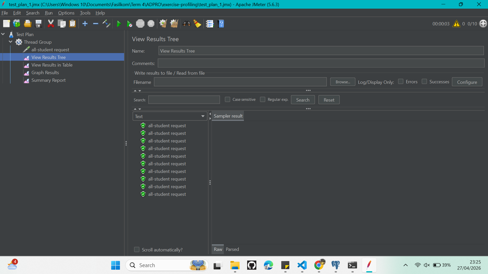
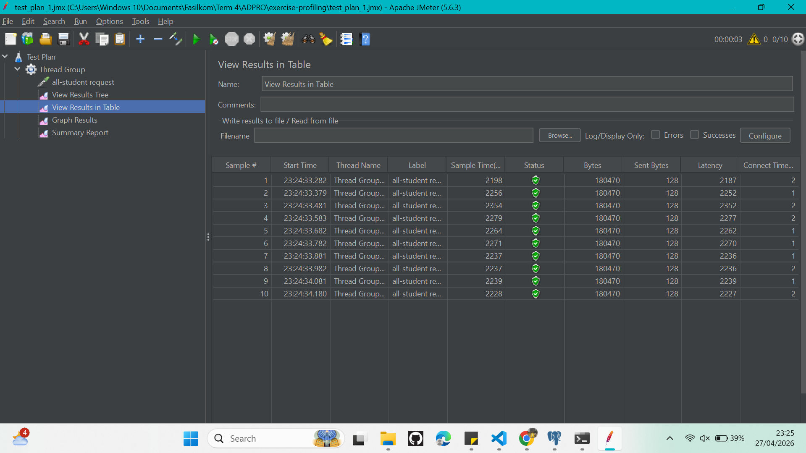
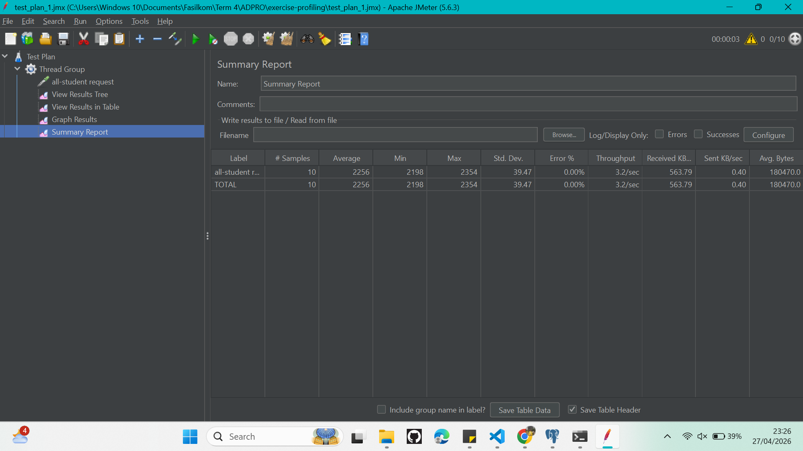
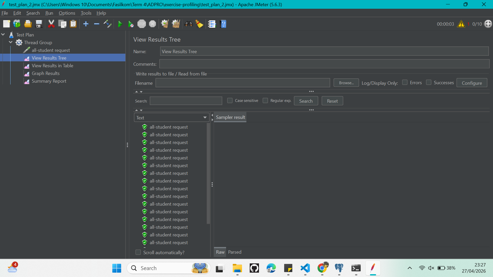
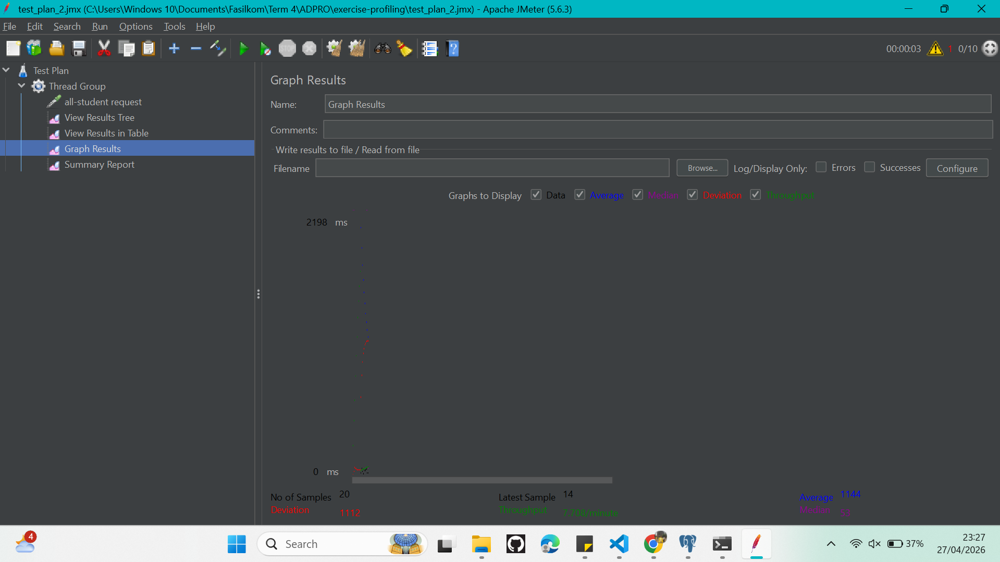
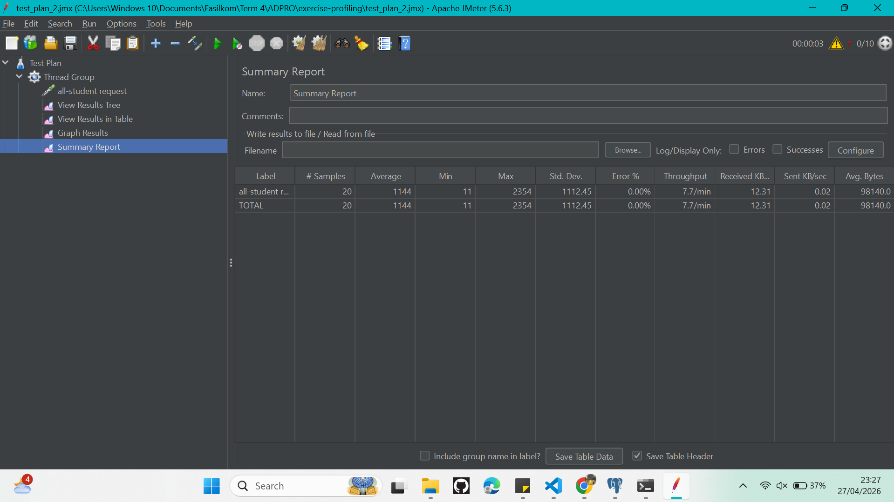
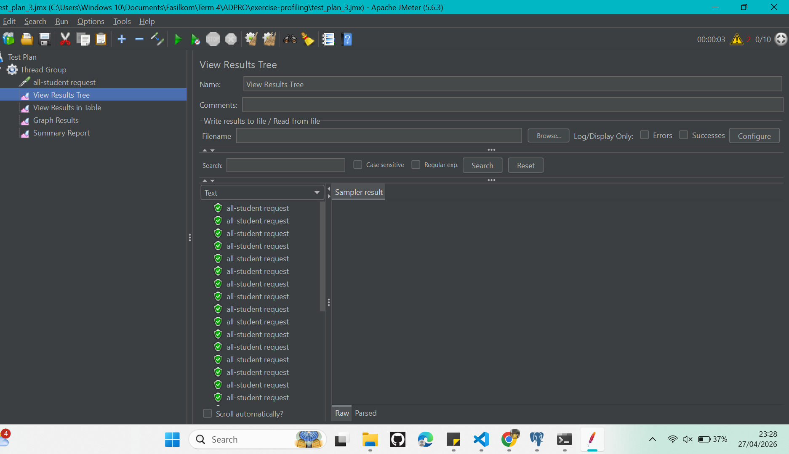
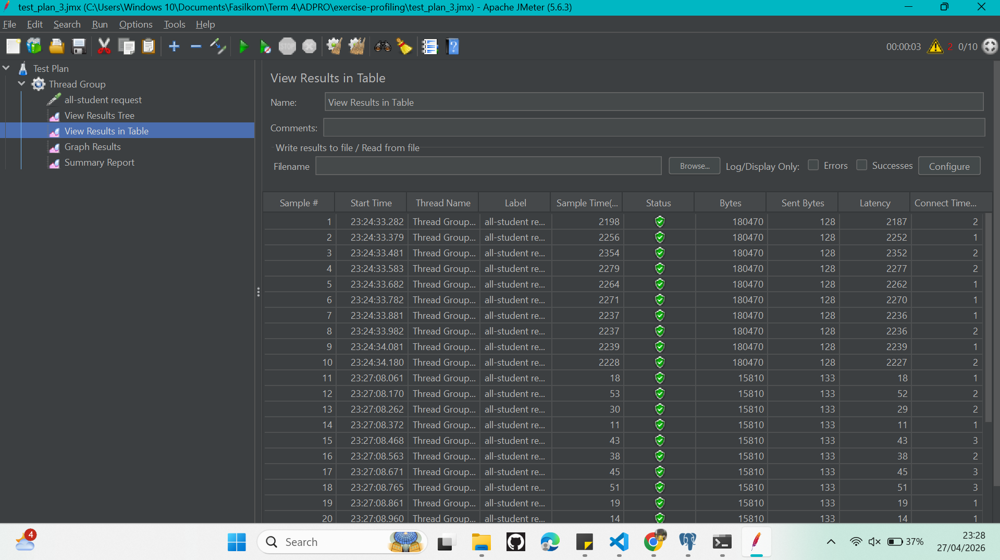

# Tutorial 7 - Profiling

## Hasil JMeter

### `/all-student`

**Sebelum Optimasi**  

**Setelah Optimasi**  

---

### `/all-student-name`

**Sebelum Optimasi**  

**Setelah Optimasi**  

---

### `/highest-gpa`

**Sebelum Optimasi**  

**Setelah Optimasi**  

---

## Hasil Profiling (IntelliJ Profiler - CPU Time)

**Sebelum Optimasi**  

**Setelah Optimasi**  

---

## Test Plan JMeter

### Test Plan 1

---

### Test Plan 2

---

### Test Plan 3

---

## Perbandingan Performa

### Hasil JMeter (Rata-rata Sample Time dalam ms)

| Endpoint          | Sebelum | Sesudah | Peningkatan        |
|-------------------|---------|---------|-------------------|
| /all-student      | 2127 ms | 161 ms  | ~92,4% lebih cepat |
| /all-student-name | 45 ms   | 19 ms   | ~57,8% lebih cepat |
| /highest-gpa      | 33 ms   | 18 ms   | ~45,5% lebih cepat |

### Hasil IntelliJ Profiler (CPU Time dalam ms)

| Method                      | Sebelum | Sesudah | Peningkatan        |
|-----------------------------|---------|---------|-------------------|
| getAllStudentsWithCourses()  | 1357 ms | 128 ms  | ~90,6% lebih cepat |

---

## Kesimpulan

Ketiga endpoint menunjukkan peningkatan performa yang signifikan setelah optimasi, jauh melampaui target peningkatan minimal 20%.

Endpoint `/all-student` menunjukkan peningkatan paling drastis, dari 2127 ms menjadi 161 ms pada pengujian JMeter. Hal ini dicapai dengan mengganti N+1 query problem menggunakan satu query `JOIN FETCH`. Sebelumnya, aplikasi mengirimkan query database terpisah untuk setiap student, kini digantikan dengan satu query yang efisien menggunakan JPQL.

Endpoint `/all-student-name` meningkat dengan hanya mengambil kolom `name` langsung dari database tanpa memuat seluruh field student, serta mengganti concatenation string yang lambat dengan `String.join()`.

Endpoint `/highest-gpa` meningkat dengan mendelegasikan pengurutan dan filtering ke database menggunakan `ORDER BY gpa DESC LIMIT 1`, menggantikan proses memuat semua student ke memori lalu melakukan iterasi di Java.

Secara keseluruhan, optimasi pada level database — seperti penggunaan JOIN yang tepat, pembatasan kolom yang diambil, dan pendelegasian pengurutan ke database — memberikan dampak yang jauh lebih besar dibandingkan optimasi pada level aplikasi saja.

---

## Reflection

**1. Apa perbedaan antara pendekatan performance testing dengan JMeter dan profiling dengan IntelliJ Profiler dalam konteks optimasi performa aplikasi?**

JMeter melakukan pengujian dari sisi luar aplikasi (black-box), mengukur waktu respons dan throughput seperti yang dirasakan oleh pengguna. Sementara itu, IntelliJ Profiler bekerja dari dalam aplikasi (white-box), menunjukkan secara detail method mana yang mengonsumsi CPU time dan memori paling banyak. Keduanya saling melengkapi: JMeter memberi tahu bahwa ada masalah performa, sedangkan IntelliJ Profiler membantu menemukan penyebabnya.

**2. Bagaimana proses profiling membantu kamu dalam mengidentifikasi dan memahami titik lemah pada aplikasi?**

Profiling memungkinkan kita melihat secara langsung method mana yang paling banyak mengonsumsi waktu eksekusi melalui flame graph dan method list. Pada latihan ini, profiling mengungkapkan bahwa `getAllStudentsWithCourses` menjadi bottleneck utama karena melakukan query database secara berulang untuk setiap student, yang dikenal sebagai N+1 query problem.

**3. Apakah kamu rasa IntelliJ Profiler efektif dalam membantu menganalisis dan mengidentifikasi bottleneck pada kode aplikasi?**

Ya, IntelliJ Profiler sangat efektif. Fitur flame graph dan method list dengan kolom CPU time memudahkan identifikasi method yang bermasalah secara langsung tanpa harus menebak-nebak. Fitur comparison view juga sangat membantu untuk membuktikan bahwa optimasi yang dilakukan benar-benar memberikan peningkatan performa yang nyata.

**4. Apa saja tantangan utama yang kamu hadapi saat melakukan performance testing dan profiling, dan bagaimana cara mengatasinya?**

Tantangan utama adalah hasil pengukuran yang tidak konsisten akibat JVM warmup pada saat pertama kali aplikasi dijalankan. Selain itu, waktu respons endpoint yang sangat lambat sebelum optimasi membuat proses pengujian memakan waktu lama. Tantangan ini diatasi dengan melakukan pemanasan JVM terlebih dahulu sebelum mengambil pengukuran, yaitu dengan menjalankan aplikasi, mengakses endpoint sekali, lalu merestart sebelum pengukuran sesungguhnya dilakukan.

**5. Apa manfaat utama yang kamu peroleh dari penggunaan IntelliJ Profiler untuk profiling kode aplikasi?**

Manfaat utamanya adalah kemampuan untuk langsung melihat method mana yang menjadi penyebab lambatnya aplikasi beserta waktu eksekusinya secara akurat. IntelliJ Profiler juga terintegrasi langsung dengan IDE sehingga kita bisa langsung melompat ke kode yang bermasalah dan segera melakukan perbaikan tanpa berpindah tool.

**6. Bagaimana kamu menangani situasi di mana hasil profiling dengan IntelliJ Profiler tidak sepenuhnya konsisten dengan temuan dari performance testing menggunakan JMeter?**

Ketidakkonsistenan antara keduanya wajar terjadi karena JMeter mengukur waktu end-to-end termasuk network latency dan overhead HTTP, sedangkan IntelliJ Profiler hanya mengukur waktu eksekusi CPU di dalam aplikasi. Jika terjadi ketidakkonsistenan, analisis dilakukan secara terpisah: profiler digunakan untuk mengoptimasi kode, sementara JMeter digunakan untuk memvalidasi bahwa optimasi tersebut berdampak nyata pada performa dari sisi pengguna.

**7. Strategi apa yang kamu terapkan dalam mengoptimasi kode aplikasi setelah menganalisis hasil dari performance testing dan profiling? Bagaimana kamu memastikan perubahan yang dilakukan tidak memengaruhi fungsionalitas aplikasi?**

Strategi yang diterapkan adalah mendelegasikan sebanyak mungkin pekerjaan ke database, seperti menggunakan `JOIN FETCH` untuk menghindari N+1 query, mengambil hanya kolom yang dibutuhkan, dan mendelegasikan pengurutan ke database dengan `ORDER BY`. Untuk memastikan fungsionalitas tidak terganggu, setiap endpoint diuji kembali setelah optimasi dengan mengaksesnya langsung melalui browser atau Postman untuk memverifikasi bahwa data yang dikembalikan tetap benar dan sesuai.